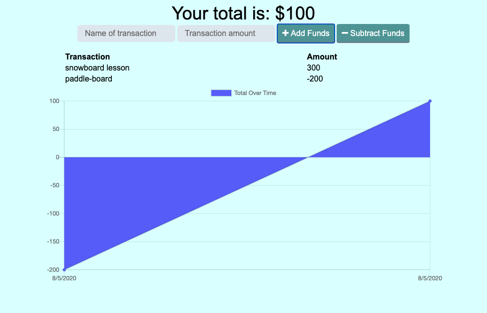

# Budget-Tracker

  ## Project Creator: 
  ### Andrew Bergstrom
---
  
  ## Project Description:
  ### This budget tracker is an easy to use app that works offline.
  
---
 
  ## Table of Content
  1. [Installation](#Installation)
  2. [Usage](#Usage)
  3. [Contributing](#Contributing)
  4. [Links](#Links)
  5. [Email](#Contact)
  
  ---

  ## Installation:
  ## Developers will need to run an npm install for all dependencies listed in the package.json

  ---      

  ## Usage:
  ## Enter the name of your transaction, then enter the dollar amount and select either add funds or subtract funds.
 ---

 ## Contributing:
 ## Please contact Andrew via email.
---

 ## Links

  linkedIn: https://www.linkedin.com/in/andrew-bergstrom-74a79aa4/

  Github: https://github.com/AndrewBergstrom
  ---
  ## Contact
  If you have any questions, contact the author directly at Andrew.Bergstrom88@gmail.com

  [Back to the top](#Budget-Tracker)
  
